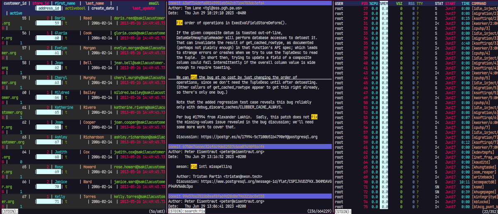

+++
author = "Noboru Saito"
title = "ov - ターミナルページャー"
menuPre = "<i class='fab fa-github'></i> "
description = "ov - 機能豊富なページャー"
tags = "ov"
weight = 3
linktitle = "ov"
+++

機能豊富なターミナルページャー

{}Download{}

{}
[<i class="fab fa-github"></i>インストール、設定についてはgithubを参照してください。](https://github.com/noborus/ov)
{}

## 特徴

* メモリより大きなファイルを素早く開くことができます。
* 固定ヘッダー行と列をサポートします。
* 列モードとカスタマイズ可能な列の色で表形式のテキストに最適化されています。
* ショートカットキーやスタイルを完全にカスタマイズ可能です。
* リアルタイム更新のフォローモード（`tail -f` / `tail -F` のような機能）。
* コマンド出力を動的に表示する実行モード。
* ファイルの変更を定期的に監視するウォッチモード。
* 高度な検索機能：インクリメンタル検索、正規表現検索、フィルター機能。
* 複数の単語に対するマルチカラーハイライト。
* Unicodeおよび東アジアの幅文字をサポート。
* 圧縮ファイル（gzip、bzip2、zstd、lz4、xz）を処理可能。

## 使用事例

ページャーは大きく分けて、テキストファイルや標準入力から受け取って表示するパターンと、コマンドの内部から呼び出されて自動で起動するパターンがあります。
テキストファイルや標準入力から受け取って表示する場合は、コマンドを指定するときにオプションを指定して起動します。
コマンドの内部から呼び出される場合は、そのコマンドの設定ファイルや環境変数を設定することで、ovをページャーとして使用できます。

例えば、`git diff`をgitのページャーの設定として指定して起動する場合と、`git diff | ov`のようにコマンドを指定して起動する場合では、`git`コマンドの内部動作が異なり、表示も異なります。

{}
